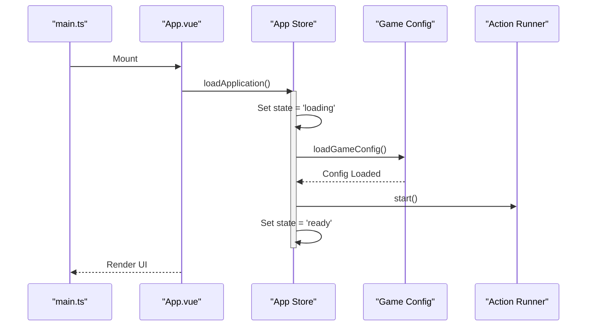

# 核心架构概念

## 1. 数据驱动 (Data-Driven)

游戏的核心逻辑高度依赖于静态配置数据。所有的技能、物品、敌人、动作等都定义在 `src/data/` 目录下的 JSON 文件中。
应用启动时，`src/gameConfig/index.ts` 会加载这些数据，并将其转换为内部使用的对象结构。

## 2. 游戏循环 (Game Loop)

虽然是放置类游戏，但仍有核心循环：
1.  **ActionRunner**: 负责执行当前的动作（如采集）。
2.  **Combat**: 负责战斗逻辑的模拟和执行。
3.  **Tick**: 通过定时器或时间差计算进度。

## 3. 数值系统

为了处理大数值和精度问题，项目使用了自定义的定点数系统 (`FixedPoint`)，位于 `src/utils/fixedPoint.ts`。所有的经验值、资源数量等核心数值都应使用此系统。

## 4. 初始化流程

