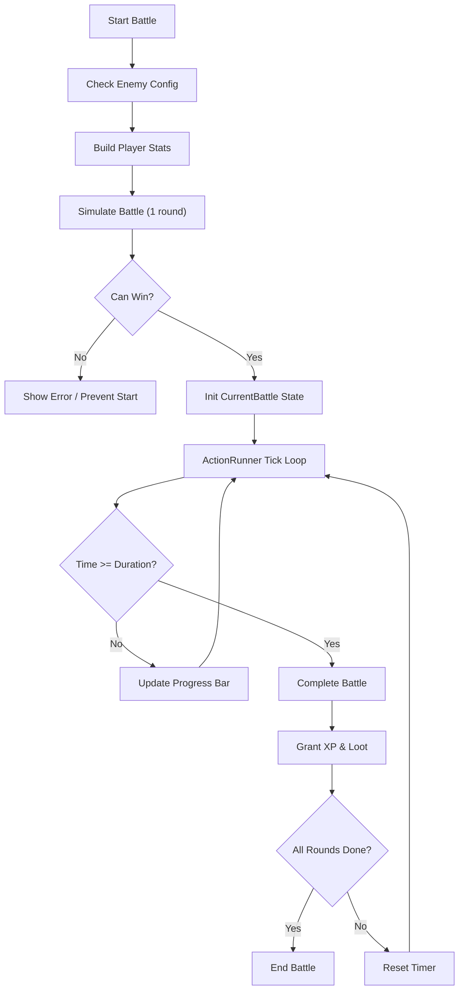
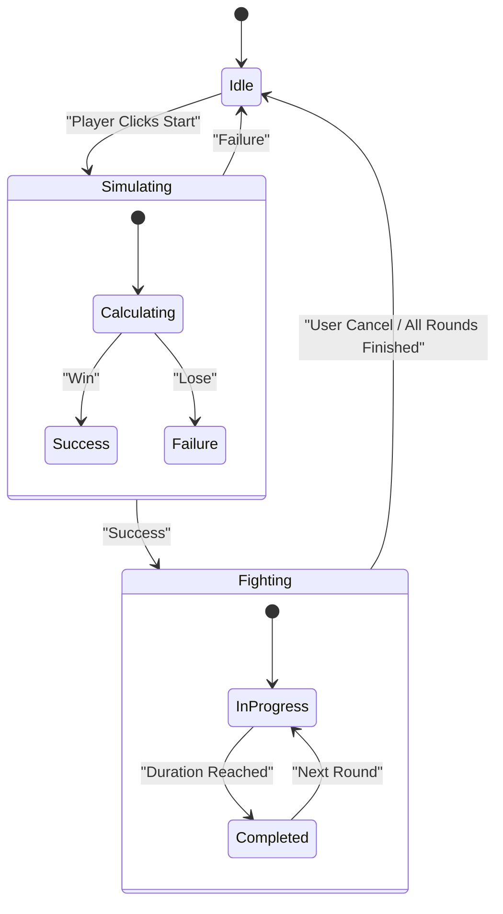

# 战斗系统设计文档

战斗系统采用“模拟+执行”的机制。在玩家开始战斗前，系统会先模拟战斗结果，确定胜负和效率，然后开始挂机执行。

## 1. 属性系统

玩家属性完全由技能等级决定（无随机性，除装备加成外）。

### 1.1 基础属性
直接对应技能等级：
- **Melee Attack**: 对应 `Melee` 技能等级
- **Ranged Attack**: 对应 `Ranged` 技能等级
- **Magic Attack**: 对应 `Magic` 技能等级
- **Defense**: 对应 `Defense` 技能等级
- **Stamina**: 对应 `Stamina` 技能等级
- **Intelligence**: 对应 `Intelligence` 技能等级

### 1.2 衍生属性
- **Max HP** = `10 * (10 + Stamina)`
- **Max MP** = `10 * (10 + Intelligence)`
- **Armor** = `0.2 * Defense`
- **Physical Damage Reduction**:
    - If Armor >= 0: `100 / (100 + Armor)` (受到的伤害比例)
    - If Armor < 0: `(100 - Armor) / 100` (受到的伤害比例，即增加伤害)

## 2. 战斗流程

### 2.1 模拟阶段 (`utils/combatSimulator.ts`)
在玩家点击开始战斗时触发。
1. **构建玩家快照**: 获取当前玩家的所有属性。
2. **模拟战斗**: 运行快速模拟，计算：
    - 是否能获胜 (`canWin`)
    - 单场战斗耗时 (`duration`)
    - 经验获取效率 (`xpGains`)
    - 资源消耗（如食物、箭矢 - 待实现）
3. **结果处理**:
    - 如果无法获胜，阻止战斗开始。
    - 如果可以获胜，将模拟结果缓存，用于 UI 显示（预计收益）。

### 2.2 执行阶段 (`stores/combat.ts` & `stores/actionRunner.ts`)
1. **初始化**: 创建 `currentBattle` 对象，记录开始时间、敌人信息、总次数。
2. **Tick**: `ActionRunner` 不断更新进度。
3. **完成**: 当时间达到 `singleBattleDuration`：
    - 调用 `completeBattle()`。
    - 发放奖励：经验值加到 `Skill Store`，物品加到 `Inventory Store`。
    - 增加 `completedAmount`。
    - 重置 `startTime` 开始下一场。
4. **结束**: 当达到预设次数或玩家手动停止时，清除战斗状态。

### 2.3 战斗循环流程图



### 2.4 战斗状态机



## 3. UI 布局设计

### 3.1 战斗页面 (CombatPage)

```text
+---------------------------------------------------------------+
|  Enemy Info Header                                            |
|  [Enemy Icon]  Enemy Name (Level X)                           |
|  HP: [====================] 100/100                           |
+---------------------------------------------------------------+
|                                                               |
|  +-------------------+         +-------------------+          |
|  |                   |   VS    |                   |          |
|  |    Player Avatar  |         |    Enemy Avatar   |          |
|  |                   |         |                   |          |
|  +-------------------+         +-------------------+          |
|                                                               |
|  Player HP: [==========]       Enemy HP: [==========]         |
|  Attack: 15                    Attack: 12                     |
|  Defense: 5                    Defense: 0                     |
|                                                               |
+---------------------------------------------------------------+
|  Battle Controls                                              |
|  [Start Battle (1x)]  [Start Battle (10x)]  [Start Infinite]  |
|  [Stop Battle]                                                |
+---------------------------------------------------------------+
|  Battle Log / Loot Preview                                    |
|  - You hit Rat for 10 damage.                                 |
|  - Rat hits you for 2 damage.                                 |
|  - You gained 50 XP.                                          |
|  - Found: Rat Tail x1                                         |
+---------------------------------------------------------------+
```

## 4. 伤害公式

- **攻击力 (Attack)**: 根据当前攻击类型（近战/远程/魔法）取对应技能等级。
- **基础伤害**: `10 + Attack`
- **攻击间隔**: `3000ms / (1 + Attack / 2000)` (基础 3秒，随攻击力提升而减少)
- **实际伤害**: `RawDamage * DamageReduction`

## 4. 掉落系统

- **固定掉落**: 敌人配置中定义的 `fixedLootItems`，每场战斗必掉。
- **宝箱点数**: 敌人配置中定义的 `fixedChestPoints`，用于累积开启宝箱。

## 5. 经验获取

战斗胜利后，玩家会获得经验值。经验值根据战斗中的表现动态计算：

- **攻击技能 (Melee/Ranged/Magic)**: 获得经验 = **造成的实际伤害**。
    - 例如，使用近战攻击造成 50 点伤害，则 Melee 技能获得 50 XP。
- **防御技能 (Defense)**: 获得经验 = **抵挡的伤害**。
    - 抵挡伤害 = 敌人原始伤害 - 玩家实际受到的伤害。
    - 例如，敌人攻击 100，玩家护甲减免后受到 80，则 Defense 技能获得 20 XP。
- **耐力技能 (Stamina)**: 获得经验 = **承受的实际伤害**。
    - 例如，玩家实际受到 80 点伤害，则 Stamina 技能获得 80 XP。

这种机制鼓励玩家平衡发展：攻击越高升级越快，防御越高防御技能升级越快，血量越多（能承受更多伤害）耐力升级越快。
