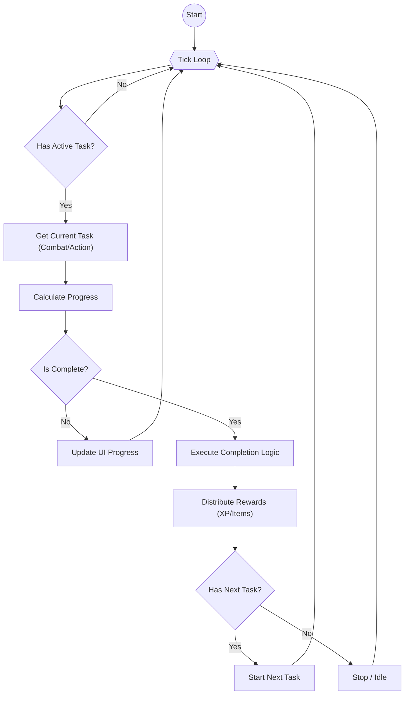

# 状态管理设计文档 (Pinia Stores)

前端应用的状态通过 Pinia Stores 进行模块化管理。

## 1. Store 概览

| Store Name | 文件位置 | 职责 |
| :--- | :--- | :--- |
| `app` | `stores/app.ts` | 全局应用状态（加载、就绪、错误），负责初始化流程。 |
| `inventory` | `stores/inventory.ts` | 玩家背包管理。增删物品、检查物品数量、开启宝箱。 |
| `skill` | `stores/skill.ts` | 技能系统。管理技能经验 (XP)、等级计算、升级进度。 |
| `combat` | `stores/combat.ts` | 战斗系统。玩家属性计算、战斗状态、战斗模拟结果。 |
| `action` | `stores/action.ts` | (推测) 管理当前选中的动作。 |
| `actionQueue` | `stores/actionQueue.ts` | 动作队列管理，允许玩家安排一系列动作。 |
| `actionRunner` | `stores/actionRunner.ts` | 动作执行器。负责 Tick 循环，根据时间进度执行动作或战斗。 |
| `notification` | `stores/notification.ts` | 全局通知系统。 |
| `itemModal` | `stores/itemModal.ts` | 物品详情弹窗的状态控制。 |

## 2. 核心 Store 详解

### 2.1 Inventory Store
- **State**: `inventoryMap` (ItemId -> Count)
- **Getters**: `inventoryItems` (排序后的物品列表)
- **Actions**:
    - `addItem(itemId, amount)`
    - `removeItem(itemId, amount)`
    - `openChest(item, amount)`: 处理宝箱开启逻辑，计算掉落并添加到背包。

### 2.2 Skill Store
- **State**: `skillXpMap` (SkillId -> XP FixedPoint)
- **Getters**:
    - `getSkillLevel(skillId)`: 根据 XP 表计算等级。
    - `getUpgradeProgress(skillId)`: 计算当前等级的进度百分比。
- **Actions**:
    - `addSkillXp(skillId, xp)`: 增加经验，检测升级并发送通知。

### 2.3 Combat Store
- **State**:
    - `currentBattle`: 当前进行的战斗状态（敌人、进度、统计）。
    - `lastBattleResult`: 最近一次模拟的结果。
- **Getters**:
    - **属性计算**: 基于 `Skill Store` 的等级计算玩家属性 (HP, MP, Atk, Def 等)。
        - `atkMelee` = Melee Level
        - `maxHp` = 10 * (10 + Stamina Level)
- **Actions**:
    - `startBattle(enemyId, amount)`: 初始化战斗，运行模拟器预测结果。
    - `completeBattle()`: 结算单场战斗奖励。

### 2.4 ActionRunner Store
这是游戏的“心脏”。它通常包含一个循环（`setInterval` 或 `requestAnimationFrame`），负责：
1. 检查当前是否有活动动作或战斗。
2. 更新进度条。
3. 当进度完成时，调用相应的 `complete` 方法（如 `combatStore.completeBattle()` 或采集动作的完成）。
4. 分发奖励（经验、物品）。

### ActionRunner 循环流程

## 3. Store 间交互

- **Combat -> Skill**: 战斗属性直接依赖于技能等级。
- **ActionRunner -> Combat/Skill/Inventory**: 执行器驱动各个系统的进度，并触发奖励发放。
- **App -> ActionRunner**: 应用启动时启动 Runner。

## 4. 持久化 (Persistence)

(待补充) 目前代码中未详细展示持久化逻辑，通常会使用 `pinia-plugin-persistedstate` 或自定义插件将关键 Store 的 State 保存到 LocalStorage。
