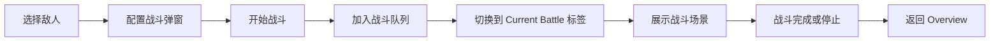

# 战斗页面布局 (CombatPage)

本文件详细描述战斗页面的布局、组成部分与交互流程，帮助在不查看代码的情况下理解界面结构。

## 1. 页面概览

```text
+-------------------------------------------------------------+
| Tab Strip: [Overview] [Current Battle]*                     |
+-------------------------------------------------------------+
| Active Tab Content                                          |
| (Overview 或 Current Battle)                                |
+-------------------------------------------------------------+
```

- **Tab Strip**: 使用按钮式标签。`Current Battle` 仅在页面上存在进行中的战斗时显示。
- **Active Tab**: 根据当前标签展示“概览”或“当前战斗”视图。

## 2. 标签区 (Tab Strip)

| 标签           | 显示条件                                | 内容摘要                               |
| :------------- | :-------------------------------------- | :------------------------------------- |
| `Overview`     | 永久显示                                | 战斗入口列表、技能状态                 |
| `Current Battle` | 仅在战斗进行中                         | 战斗状态面板、进度展示、剩余次数信息   |

切换逻辑：开始战斗后自动切换到 `Current Battle`；战斗结束或停止后自动回到 `Overview`。

## 3. Overview 标签内容

```text
+-------------------------------------------------------------+
| Gradient Summary Card                                       |
| - 标题 / 描述 / 引导文案                                    |
+-------------------------------------------------------------+
| Combat Skill Chips (levels)                                 |
| - 战斗类技能等级徽章                                         |
+-------------------------------------------------------------+
| EnemyList Grid                                              |
| - 多列卡片：名称 / 战利品 / [Select] 按钮                   |
| - 点击后打开战斗配置弹窗                                    |
+-------------------------------------------------------------+
```

### 3.1 Summary Card
- 渐变背景，突出战斗主题。
- 包含标题、说明文本，可扩展为显示整体战斗力提示。

### 3.2 Combat Skill Chips
- 显示战斗类技能的名称与等级，用于快速评估玩家战斗属性。

### 3.3 EnemyList Grid
- 每个敌人卡片展示：名称、等级、基础掉落、宝箱点数等。
- 提供 `Select` 按钮，点击后弹出战斗配置浮层以选择战斗参数。

## 4. Current Battle 标签内容

```text
+-------------------------------------------------------------+
| Battle Arena (Player vs Enemy)                              |
| - 左：玩家卡片                                              |
|   - 头像、HP/MP 条、攻击力徽章、攻击进度条                  |
| - 右：敌人卡片                                              |
|   - 头像、HP 条、攻击力/间隔                                |
+-------------------------------------------------------------+
| Bottom Info Bar                                             |
| - 剩余战斗次数 (∞ 表示无限)                                 |
| - 补充提示/状态                                             |
+-------------------------------------------------------------+
```

### 4.1 玩家卡片 (左侧)
- 头像（Emoji 或图标）、玩家 HP/MP、攻击力徽章。
- 攻击冷却条随时间推进逐渐填充，提示下一次攻击的节奏。

### 4.2 敌人卡片 (右侧)
- 使用敌人配置中的 `name`、`hp`、`attack` 等数据。
- 展示敌人 HP 条、攻击力徽章、攻击间隔信息。

### 4.3 Bottom Info Bar
- 显示剩余战斗次数（∞ 表示无限战斗）。
- 预留提示区域，可扩展为显示下一次结算时间等信息。

## 5. 状态与流程



- 实际战斗逻辑由全局战斗队列驱动，CombatPage 负责展示状态与进度。
- 若用户停止战斗或队列运行结束，会自动清空当前战斗并回到概览视图。

## 6. 响应式与滚动

- **Overview Tab**: 敌人列表区域支持纵向滚动，方便在设备视口较小时浏览全部敌人。
- **Current Battle Tab**: 战斗场景根据视口高度自适应，确保在容器内部滚动而非整页拖动。
- **Modal**: 弹窗在桌面端居中，移动端会覆盖全屏以便阅读。

---
如需进一步修改布局，可参考 `src/pages/CombatPage.tsx` 与相关组件 (`EnemyList`, `EnemyModalBox`, `ActionQueue`) 的具体实现。
